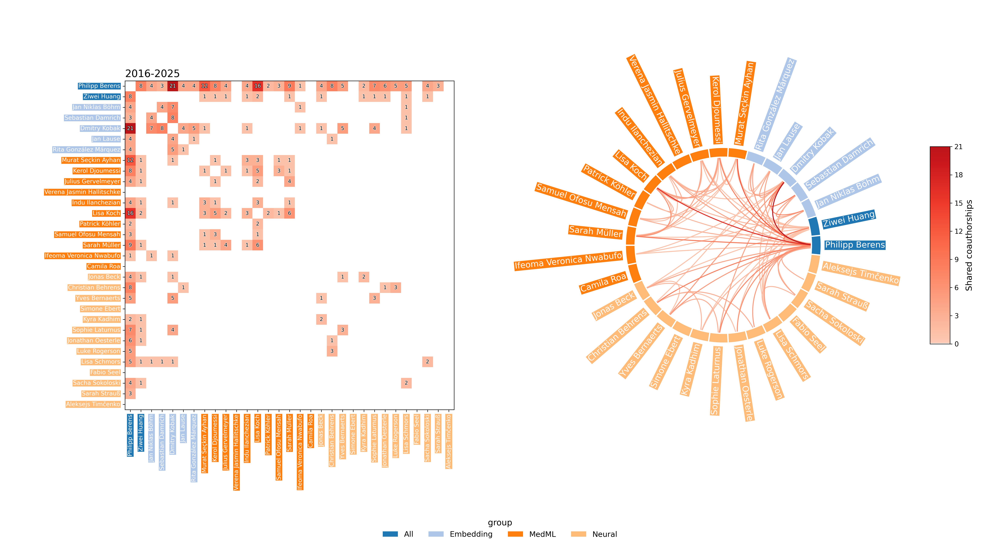

# cooplot

Analysis of co-op between members and subgroups.

## Example Gallery

## Cluster of Excellence – Machine Learning for Science

```python
import cooplot
palette = {
    "Life Science": "#61859e",
    "Norms": "#e0aa41",
    "Human Science": "#5fb4d0",
    "ML": "#bc3b2f",
    "Physical Science": "#608dd2",
}

_, people = cooplot.load_csv("excelclust.csv", delimiter=";")
pubs = cooplot.scrape(
    people,
    name_col="name",
    scholar_col="scholar_id",
    semantic_col="semantic_id",
    cache_dir=".cache/excelclust",
)
mats = cooplot.build(pubs, windows=["2014-2018", "2019-2023"], name_col="name", group_col="group")
fig = cooplot.show(mats, group_col="group", style="circle", heatmap_counts=True, palette=palette)
fig.savefig("../.github/excelclust.png", dpi=300)
```


## AG Berens

```python
import cooplot
header, people = cooplot.load_csv("agberens.csv", delimiter=";")
pubs = cooplot.scrape(
    people,
    name_col="name",
    scholar_col="scholar_id",
    semantic_col="semantic_id",
    cache_dir=".cache/hai",
    drop_subtitle=False,
    fallback_semantic_if_empty=True,  # try Semantic if GS had 0 pubs
)


mats = cooplot.build(pubs, windows=["2016-2025"], name_col="name", group_col="group")
fig = cooplot.show(mats, group_col="group", style="both", heatmap_counts=True, figsize=(18,10))
```



## HZN 

```python
import cooplot
header, people = cooplot.load_csv("hzn.cleaned.csv", delimiter=",")
pubs = cp.scrape(
    people,
    name_col="name",
    scholar_col="scholar_id",
    semantic_col="semantic_id",
    cache_dir=".cache/hzn",
)
groups = cooplot.aggregate(pubs, name_col="name", cache_dir=".cache/hzn-group")
res = cooplot.cross_group_publications(groups, year_from=2020, year_to=2025, out_path="./output/hzn-coop.csv", enrich_pubmed=True)
cooplot.metrics.cross_group_report("./output/hzn-coop.csv", out_path="./output/hzn-coop-ref.txt", verbose=True)
```

Reference List:

```
Rosa, F., Grimm, A., Ambjoernsen, K., & Pomper, J. K. (2020). A gaze-triggered downbeat nystagmus persisting in primary position in a patient with hypomagnesemia combined with anti-SOX1. Journal of the Neurological Sciences, 412, 116732. https://doi.org/10.1016/j.jns.2020.116732
Collaboration: N-Epi (Alexander Grimm) and N-Vask (Jörn Pomper).

Siebert, R., Taubert, N., Spadacenta, S., Dicke, P. W., Giese, M. A., & Thier, P. (2020). A Naturalistic Dynamic Monkey Head Avatar Elicits Species-Typical Reactions and Overcomes the Uncanny Valley. Eneuro, 7(4), ENEURO.0524-19.2020. https://doi.org/10.1523/eneuro.0524-19.2020
Collaboration: N-Dyn (Peter Dicke), N-unabh (Ramona Siebert, Peter Thier), and N3 (Martin Giese, Nick Taubert).

Bhattacharjee, A., Kajal, D. S., Patrono, A., Li Hegner, Y., Zampini, M., Schwarz, C., & Braun, C. (2020). A Tactile Virtual Reality for the Study of Active Somatosensation. Frontiers in Integrative Neuroscience, 14. https://doi.org/10.3389/fnint.2020.00005
Collaboration: N-Dyn (Christoph Braun, Yiwen Li Hegner) and N3 (Cornelius Schwarz).

...
```

## Installation

```bash
uv pip install -e ".[dev]"
```

## Usage

See the [example notebook](https://github.com/berenslab/cooplot/blob/main/notebooks/agberens.ipynb) for a complete usage example.