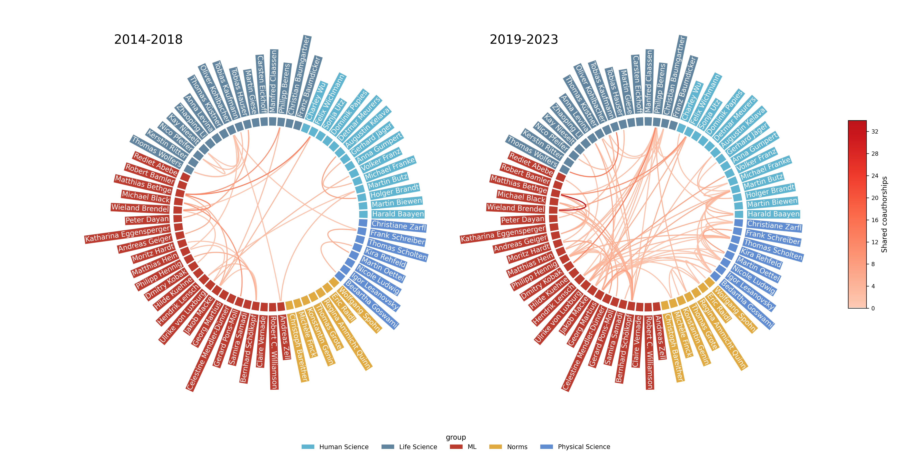

# cooplot

Analysis of co-op between members and subgroups.

## Gallery

## Cluster of Excellence – Machine Learning for Science



## AG Berens


## Installation

```bash
uv pip install -e ".[dev]"
```

## Usage

See the [example notebook](https://github.com/berenslab/cooplot/blob/main/notebooks/agberens.ipynb) for usage.