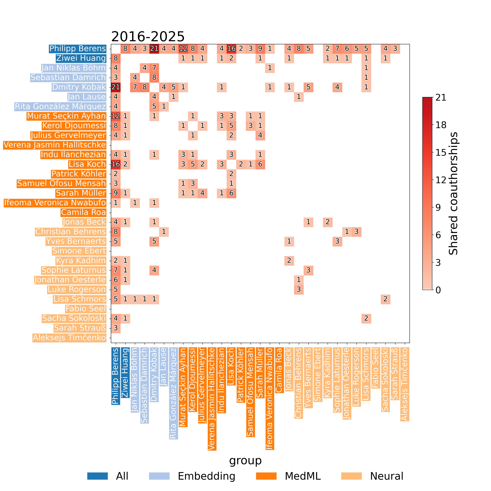

# cooplot

Analysis of co-operation between members and subgroups.



## Installation

```bash
source .venv/bin/activate
uv pip install ".[dev]"
```

## Usage

See the [example notebook](https://github.com/berenslab/cooplot/blob/main/notebooks/agberens.ipynb) for usage.